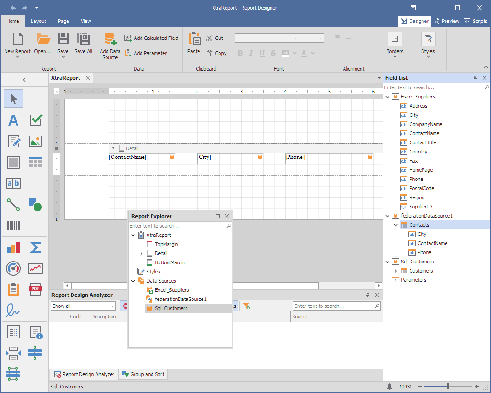

# Reporting for WinForms - Bind Report to Union-based Federated Data Source

You can create a federated data source to display data combined from several sources. This topic shows how to use the **Union** operation to combine data into a single query.

## Files to Review

- [Form1.cs](CS\Reporting-Bind-Report-to-Union-Based-Federated-Data-Source\Form1.cs) (VB: [Form1.vb](VB\Reporting-Bind-Report-to-Union-Based-Federated-Data-Source\Form1.vb))

## Documentation

- [Data Federation](https://docs.devexpress.com/XtraReports/400917/detailed-guide-to-devexpress-reporting/bind-reports-to-data/data-federation)
- [FederationDataSource Class](https://docs.devexpress.com/CoreLibraries/DevExpress.DataAccess.DataFederation.FederationDataSource)

## More Examples

- [Reporting for WinForms - Bind a Report to A Federated Data Source](https://github.com/DevExpress-Examples/Reporting-Bind-Report-To-Federated-Data-Source)
- [Reporting for WinForms - Create a Federated Data Source at Runtime](https://github.com/DevExpress-Examples/how-to-create-a-federated-data-source-at-runtime)
